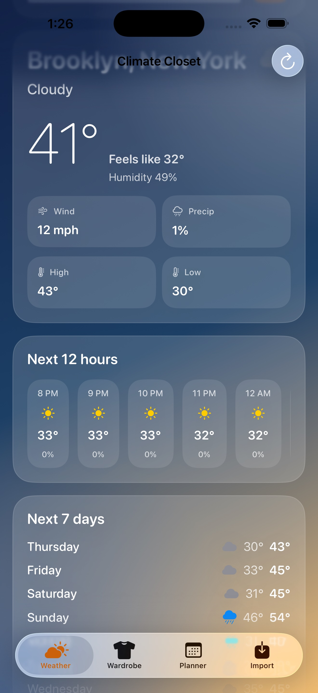
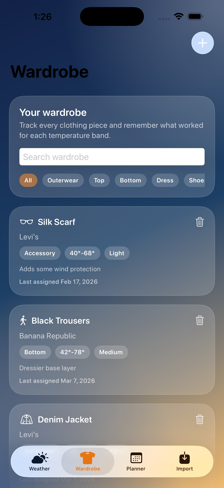
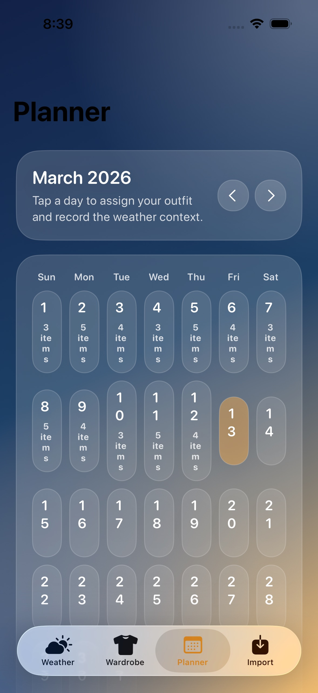
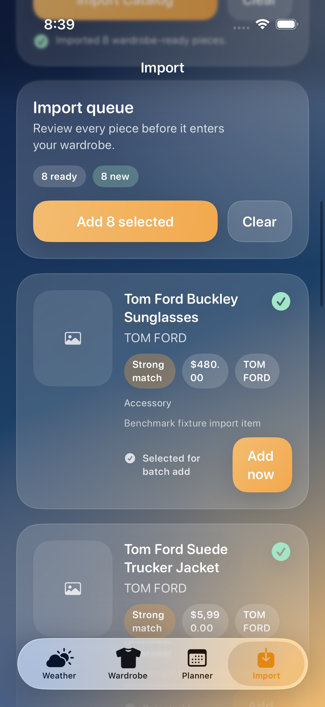

# Climate Closet

Climate Closet is an iOS SwiftUI weather app inspired by Apple's Weather experience, with a built-in wardrobe journal and planner. It helps track what you wore for specific temperatures, assign clothing to calendar days, and import wardrobe-ready catalog items from apparel product and category pages.

## What it does

- Live weather forecasts powered by Open-Meteo with current, hourly, and daily views
- Wardrobe management for every clothing item in your closet
- Shared quick-add wardrobe flow from both the Weather and Wardrobe tabs
- Day-by-day outfit assignment with temperature and condition logging
- Weather-aware outfit recommendations based on your closet and what you have worn before
- An import studio that preflights pasted URLs, blocks vague landing pages, filters out non-wardrobe products, and stages multi-item imports before they touch your closet
- Local-first persistence with a ports-and-adapters architecture that keeps the core testable

## Screenshots

<p align="center">
  
  
  
  
</p>

## Project layout

- `ClimateCloset/`: SwiftUI app target
- `ClimateCloset/Assets.xcassets`: app icon and launch screen artwork
- `ClimateCloset/LaunchScreen.storyboard`: static launch experience shown while SwiftUI boots
- `ClimateClosetTests/`: unit tests for pure domain and parsing logic
- `ClimateClosetIntegrationTests/`: adapter-level integration tests
- `docs/`: user and engineering documentation
- `scripts/`: small typed developer tooling covered by `pyright`

## Requirements

- Xcode 26.3 or newer
- iOS Simulator runtime
- Python 3.9+ for `pyright`

## Local setup

```bash
git clone https://github.com/raelldottin/climate-closet-ios.git
cd climate-closet-ios
python3 -m venv .venv
. .venv/bin/activate
python -m pip install --upgrade pip
python -m pip install -r requirements-dev.txt
```

## License

This repository is source-available, not open source.

- Software in this repository is licensed under `PolyForm Strict 1.0.0`. Noncommercial use is allowed under that license, but redistribution, relicensing, and changes or derivative works for commercial deployment require prior written permission from Raell Dottin.
- Documentation, screenshots, branding, and other non-code assets remain all rights reserved unless Raell Dottin grants prior written permission.
- See [`LICENSE`](LICENSE) for the controlling terms.

## Local signing

Device-signing overrides live in the gitignored `Config/Local.xcconfig` file so personal team identifiers never need to enter source control. A placeholder is included in `Config/Local.xcconfig.example`, and the committed `Config/App.xcconfig` plus `Config/Tests.xcconfig` load local overrides when present so app, unit, integration, and UI benchmark targets can all sign locally on hardware.

## Build channels and versioning

- `Debug` and `Release` are now intentionally distinct app builds.
- `Debug` installs as `com.raelldottin.ClimateCloset.debug` with the display name `Climate Closet Debug`, so it can live beside a release build on the same device.
- `Release` keeps the public bundle ID `com.raelldottin.ClimateCloset` and the display name `Climate Closet`.
- Public version metadata lives in `Config/AppVersion.xcconfig`, which drives both `CFBundleShortVersionString` and `CFBundleVersion`.
- Private machine-specific overrides still belong only in `Config/Local.xcconfig`.

## Verification

```bash
make verify-layout
make lint-python
make lint-swift
make test
```

`make test` runs both the unit and integration test bundles through the shared `ClimateCloset` scheme.

## UI benchmarks

The repo also includes a repeatable UI benchmark suite in `ClimateClosetUITests/ClimateClosetBenchmarks.swift`. It launches the app in a deterministic benchmark mode with a larger local wardrobe fixture, stubbed weather/import services, and a persisted JSON store so launch and save paths still exercise real rendering and repository work.

```bash
xcodebuild test \
  -project ClimateCloset.xcodeproj \
  -scheme ClimateCloset \
  -destination 'platform=iOS Simulator,name=iPhone 16' \
  -only-testing:ClimateClosetUITests/ClimateClosetBenchmarks \
  CODE_SIGNING_ALLOWED=NO
```

```bash
xcrun xctrace list devices

xcodebuild test \
  -project ClimateCloset.xcodeproj \
  -scheme ClimateCloset \
  -destination 'id=<physical-device-id>' \
  -only-testing:ClimateClosetUITests/ClimateClosetBenchmarks
```

That suite reports timing summaries for:

- launch to first weather frame
- first load when switching from Weather to Wardrobe, Planner, and Import
- saving a new wardrobe item
- importing a Tom Ford fixture URL
- saving a day assignment and note

Each benchmark now carries two explicit expectations in code:

- `target`: the level that counts as outperforming expectations
- `ceiling`: the hard upper bound for acceptable performance

The suite reports `OUTPERFORMING`, `MEETING`, or `UNDERPERFORMING` for every path and fails if a benchmark breaches its ceiling.

Simulator runs are useful for quick regressions, but the reference baseline for launch and interaction performance is the physical-device `Debug` run produced by the benchmark test target. On March 13, 2026, the attached `iPhone 15 Pro Max` on `iOS 26.0.1` produced this clean baseline:

- `launch_to_weather_root`: `OUTPERFORMING`, mean `2535.0 ms`
- `weather_to_wardrobe_first_load`: `OUTPERFORMING`, mean `2619.3 ms`
- `weather_to_planner_first_load`: `OUTPERFORMING`, mean `2436.5 ms`
- `weather_to_import_first_load`: `OUTPERFORMING`, mean `2364.8 ms`
- `save_new_wardrobe_item`: `MEETING`, mean `2118.5 ms`
- `import_tom_ford_fixture`: `MEETING`, mean `1587.4 ms`
- `save_day_assignment_and_note`: `MEETING`, mean `1805.9 ms`

The same UI target also includes `testDocumentationScreenshots`, which captures the README screenshots from the deterministic benchmark profile so docs imagery stays aligned with the real app.

## Design notes

- The app follows the unit-testing guidance from *Unit Testing: Principles, Practices, and Patterns* by keeping the domain logic pure, pushing I/O to adapters, and reserving slower tests for repository integration.
- The app icon and launch screen share the in-app atmospheric palette, combining weather and wardrobe motifs in a single brand mark.
- Shared atmospheric screens now follow an explicit design system in `SharedViews.swift`, with named spacing, radius, typography, input, and button primitives instead of one-off visual values.
- The Weather and Wardrobe tabs intentionally reuse the same add-clothing sheet so the creation gesture stays calm, direct, and consistent anywhere the app invites you to grow your closet.
- The UI contract is backed by both `docs/UI_GUIDELINES.md` and a point-in-time `docs/UI_AUDIT.md`, so exceptions and canonical patterns are documented rather than implied.
- The importer now favors clarity over false optimism: product pages and category pages are called out before import begins, while homepages and beauty catalogs are explicitly rejected instead of producing noisy fallback results.
- The default experience works in the simulator with signing disabled, while physical-device signing can stay local through `Config/Local.xcconfig`.

## Documentation

- [`docs/USER_GUIDE.md`](docs/USER_GUIDE.md)
- [`docs/ARCHITECTURE.md`](docs/ARCHITECTURE.md)
- [`docs/TESTING_STRATEGY.md`](docs/TESTING_STRATEGY.md)
- [`docs/DEMO_READINESS.md`](docs/DEMO_READINESS.md)
- [`docs/UI_GUIDELINES.md`](docs/UI_GUIDELINES.md)
- [`docs/UI_AUDIT.md`](docs/UI_AUDIT.md)
